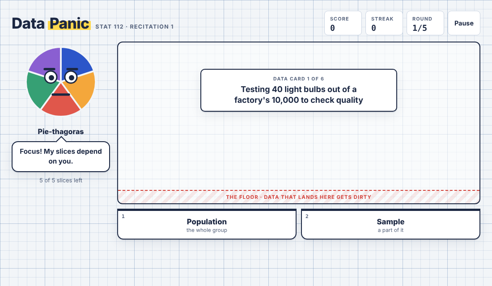

```{=html}
<style>
.game-grid { display: grid; grid-template-columns: repeat(auto-fill, minmax(280px, 1fr)); gap: 1.25rem; margin: 1.5rem 0 2rem; }
.game-card {
  display: flex; flex-direction: column; border: 1px solid var(--bs-border-color, #dee2e6); border-radius: 12px;
  overflow: hidden; background: var(--bs-body-bg, #fff); color: inherit; text-decoration: none;
  transition: transform .15s ease, box-shadow .15s ease, border-color .15s ease;
}
a.game-card:hover { transform: translateY(-3px); box-shadow: 0 8px 24px rgba(0,0,0,.10); border-color: var(--bs-primary, #2780e3); color: inherit; }
a.game-card:focus-visible { outline: 3px solid var(--bs-primary, #2780e3); outline-offset: 3px; }
.game-thumb { aspect-ratio: 16 / 9; background: #eef2f6; overflow: hidden; }
.game-thumb img { width: 100%; height: 100%; object-fit: cover; object-position: top left; display: block; margin: 0; }
.game-body { padding: 1rem 1.1rem 1.15rem; display: flex; flex-direction: column; gap: .45rem; flex: 1; }
.game-tag { font-size: .72rem; font-weight: 700; letter-spacing: .08em; text-transform: uppercase; color: var(--bs-secondary-color, #6c757d); }
.game-title { font-size: 1.2rem; font-weight: 700; margin: 0; line-height: 1.25; }
.game-desc { margin: 0; font-size: .95rem; }
.game-play { margin-top: auto; padding-top: .5rem; font-weight: 700; color: var(--bs-primary, #2780e3); }
.game-card.soon { opacity: .6; border-style: dashed; }
.game-card.soon .game-thumb { display: grid; place-items: center; font-size: 2.5rem; color: var(--bs-secondary-color, #6c757d); }
</style>
```

```{=html}
<div class="game-grid">
<a class="game-card" href="games/data-panic.html" target="_blank" rel="noopener">
  <div class="game-thumb"></div>
  <div class="game-body">
    <span class="game-tag">Recitation 1</span>
    <h3 class="game-title">Pie-thagoras' Data Panic</h3>
    <p class="game-desc">Sort falling data cards before they hit the floor: population or sample, data types, discrete or continuous, scales of measurement, parameter or statistic.</p>
    <span class="game-play">Play now →</span>
  </div>
</a>
<div class="game-card soon" aria-disabled="true">
  <div class="game-thumb">?</div>
  <div class="game-body">
    <span class="game-tag">Recitation 2</span>
    <h3 class="game-title">Coming soon</h3>
    <p class="game-desc">A new game will appear here after the next recitation.</p>
  </div>
</div>
</div>
```


