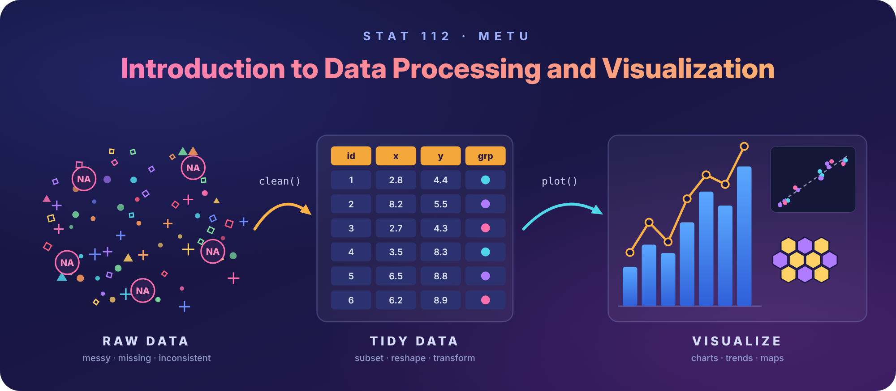

Welcome! This site is the resource hub for **STAT 112 — Introduction to
Data Processing and Visualization** at METU.

## About This Course

STAT 112 introduces the practical side of working with data: how to get it
into shape, explore it, and communicate what it shows. The course covers
the basic definitions and handling of different data types, and
builds hands-on skills in:

- **Data manipulation:** indexing, subsetting, reshaping, and transforming datasets
- **Data cleaning:** dealing with common problems such as missing or inconsistent values
- **Visualization:** choosing and building effective graphs for different kinds of data
- **Mapping:** displaying spatial data on maps
- **Analysis:** summarizing and exploring data to answer questions

{fig-alt="STAT 112 banner: raw data is cleaned into a tidy table, then visualized" width="94%"}

## Some Useful Links for Data Visualization

I will update this list as I discover new resources. Stay tuned!

::: {.callout-note}
These resources are curated to supplement the **STAT 112: Introduction to Data Processing and Visualization** syllabus. They span foundational design theory, color accessibility, Python plotting tools, and interactive dashboards.
:::

### Core Theory & Chart Selection Guides

* [Fundamentals of Data Visualization](https://clauswilke.com/dataviz/){target="_blank"} — Claus O. Wilke's open-access text on figure design, color selection, and effective visual layout.
* [From Data to Viz](https://www.data-to-viz.com/){target="_blank"} — Interactive decision tree matching chart formats directly to specific variable and data structures.
* [The Data Visualisation Catalogue](https://datavizcatalogue.com/){target="_blank"} — A reference guide explaining chart functions, visual caveats, and alternative plot designs.
* [Data Visualization: A Practical Introduction](https://socviz.co/){target="_blank"} — Kieran Healy's online book detailing visual perception, chart rhetoric, and narrative design.
* [Storytelling with Data Resources](https://www.storytellingwithdata.com/){target="_blank"} — Practical articles and exercises highlighting cognitive load, focal points, and decluttering.

### Color Systems & Accessibility

* [ColorBrewer 2.0](https://colorbrewer2.org/){target="_blank"} — Proven qualitative, sequential, and diverging palettes with colorblind-safe filters.
* [Coblis (Color Blindness Simulator)](https://www.color-blindness.com/coblis-color-blindness-simulator/){target="_blank"} — Online image checker to test how figures appear under various color deficiencies (deuteranopia, protanopia, tritanopia).
* [Adobe Color Contrast Checker](https://color.adobe.com/create/color-contrast-analyzer){target="_blank"} — Tool to evaluate background-to-text and shape contrast ratios against WCAG standards.

### Python Libraries (STAT 112 Curriculum)

* [Python Graph Gallery](https://python-graph-gallery.com/){target="_blank"} — Reproducible examples categorized by plot type, built with Matplotlib and Seaborn.
* [Seaborn Documentation & Tutorials](https://seaborn.pydata.org/tutorial.html){target="_blank"} — Statistical data visualization API focused on distribution and categorical relationships.
* [Matplotlib User Guide](https://matplotlib.org/stable/users/index.html){target="_blank"} — Foundational plotting interface in Python, essential for figure anatomy and custom formatting.
* [Pandas Visualization Guide](https://pandas.pydata.org/docs/user_guide/visualization.html){target="_blank"} — Quick built-in DataFrame plotting methods for exploratory data analysis.

### BI Tools & Interactive Dashboards

* [Tableau Public Resources & Learning](https://public.tableau.com/app/resources/learn){target="_blank"} — Sample datasets, tutorials, and community dashboards covering sheet design and dashboard actions.
* [Flourish Studio Guides](https://flourish.studio/blog/){target="_blank"} — Quick-start walkthroughs for animated charts, hierarchies, and scrollytelling presentations.

## Contact

<i class="bi bi-envelope"></i> **Email:** [serenay@metu.edu.tr](mailto:serenay@metu.edu.tr)  
<i class="bi bi-geo-alt"></i> **Office:** [Department of Statistics](https://maps.app.goo.gl/YVXLTXxut4GcMHBE9) Room No: 234.  
<i class="bi bi-telephone"></i> **Phone:** [+90 (312) 210-2979](tel:+903122102979)  
<i class="bi bi-github"></i> **GitHub:** [github.com/statserenay](https://github.com/statserenay)  
<i class="bi bi-linkedin"></i> **LinkedIn:** [serenay-çakar](https://tr.linkedin.com/in/serenay-%C3%A7akar-326768118)