## How to use this page

Each question below is interactive. Click an option or type an answer, then press **Check** (or <kbd>Enter</kbd>). The page tells you right away whether the answer is correct. **Show answer** reveals the solution and the explanation, and **Reset** clears the question so you can try it again.

::: quiz-scoreboard
Progress
:::

## Part A — Statistics: the basic vocabulary

<!-- ===================================================================== -->

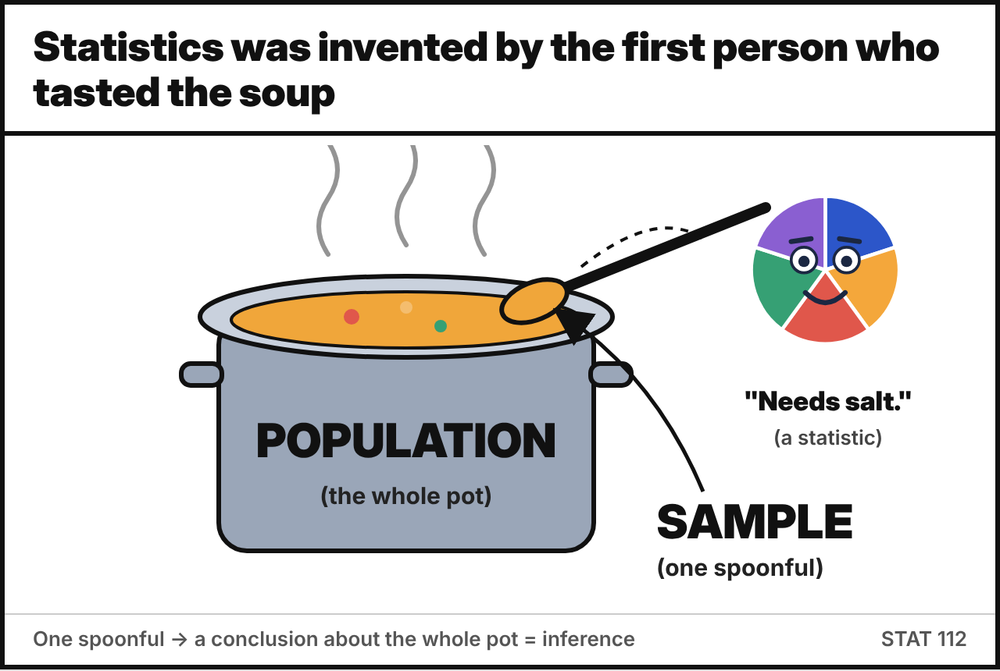{fig-align="center" width="560" fig-alt="Meme: tasting one spoonful of soup is a sample, the whole pot is the population"}

:::: {.quiz type="match"}
Match each **term** on the left with its **definition** on the right.

- Population :: The entire group of individuals or items under study
- Sample :: A subset of the population selected for study
- Variable :: A characteristic or attribute that can vary among individuals or items
- Parameter :: A numerical summary of the entire population
- Statistic :: A numerical summary of a sample
- Data :: Raw facts and figures collected from observations or experiments
- Statistics :: The field of study concerned with collecting, analyzing, presenting and interpreting data
- Experimental unit :: A single subject or object on which the variables are measured

::: explain
**P**opulation ↔ **P**arameter and **S**ample ↔ **S**tatistic: the first letters match, which makes the pairs easy to remember.
Note the two meanings of *statistics*: the **field** (Statistics) and the plural of **statistic** (numbers computed from a sample).
:::
::::

<!-- ===================================================================== -->

:::: {.quiz type="classify" options="Population|Sample"}
Decide whether each scenario describes a **population** or a **sample**.

- Counting the total number of visitors to Yellowstone National Park in a year :: Population
- Surveying a random group of 500 students at a university about their study habits :: Sample
- Collecting data on the types of smartphones owned by **all** residents of a specific city :: Population
- Analyzing online customer reviews of a popular restaurant to understand customer satisfaction :: Sample
- Calculating the average annual income of all individuals in a country based on tax records :: Population
- Testing the battery life of 40 phones taken from a factory's daily production of 10,000 phones :: Sample
- Recording the final grade of every student enrolled in STAT 112 this semester, to describe this semester's class :: Population

::: explain
Ask yourself: *does the data cover every member of the group we want to describe?*

- The restaurant reviews are a **sample**: only some customers write reviews, and they tend to be the very happy or the very unhappy ones (a *self-selected* sample).
- The STAT 112 grades are a **population** only because the group of interest is *this semester's class*. If we wanted to describe *all* STAT 112 students over the years, the same data would be a sample.
:::
::::

<!-- ===================================================================== -->

:::: {.quiz type="mc" answer="b"}
A politician is running for mayor in a city with **25,000** registered voters. She surveys **200** registered voters, and **48%** of them say they plan to vote for her.

The value **48%** is a …

- parameter
- statistic
- population
- variable

::: explain
48% describes the **200 surveyed voters** (the sample), so it is a **statistic**.

- Population: the political choices of all 25,000 registered voters
- Sample: the political choices of the 200 voters interviewed
- Variable: the candidate each voter plans to vote for
:::
::::

<!-- ===================================================================== -->

:::: {.quiz type="tf" answer="true"}
In the same city, if the politician had been able to ask **all 25,000** registered voters and 48% of them supported her, then 48% would be a **parameter**.

::: explain
**True.** A summary computed from the *whole population* is a parameter. Whether a number is a parameter or a statistic depends on **who it describes**, not on the number itself.
:::
::::

<!-- ===================================================================== -->

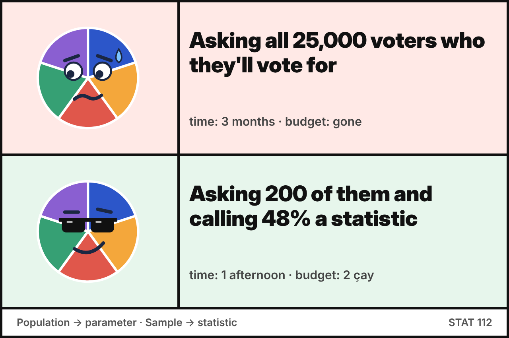{fig-align="center" width="560" fig-alt="Meme: Pie-thagoras rejects asking all 25,000 voters and approves asking 200 and calling 48% a statistic"}

:::: {.quiz type="fill"}
Fill in the blanks with the correct term.

The collection of all items of interest in a study is called the []{.blank answer="population"}, and a descriptive measure of it is called a []{.blank answer="parameter"}. A set of data drawn from it is a []{.blank answer="sample"}, and a descriptive measure of that set is called a []{.blank answer="statistic"}. A characteristic of interest that can take different values for different elements is a []{.blank answer="variable|feature"}, and the actual recorded values are the []{.blank answer="data|data values|observations"}.

::: explain
These are the five basic definitions from the lecture notes (*Basic Definitions* slide), plus **data**, which are the actual values of the variables.
:::
::::

<!-- ===================================================================== -->

:::: {.quiz type="short" answer="1500" tol="0"}
A survey of METU students records **6 variables** (age, department, GPA, weekly study hours, gender, smoking status) for each of **250 students**.

How many individual data values does the dataset contain?

::: explain
Each student is a **row** (observation) and each variable is a **column**, so the dataset has 250 × 6 = **1,500** data values.
This is the same reasoning as the lecture example: 100 individuals × 4 variables = 400 items.
:::
::::

<!-- ===================================================================== -->

:::: {.quiz type="classify" options="Population|Sample|Variable|Data|Parameter|Statistic|Experimental unit"}
Researchers want to determine the **average test score of high school students in a particular city**. They randomly select **five high schools** in the city and collect the test scores of **50 students from each school**.

Match each part of the study with the correct term.

- All high school students in the city :: Population
- The 250 selected students (50 from each of the 5 schools) :: Sample
- Test score :: Variable
- The test scores obtained from the 250 students :: Data
- The average test score of all high school students in the city :: Parameter
- The average test score of the 250 selected students :: Statistic
- An individual high school student :: Experimental unit

::: explain
The sample size is 5 × 50 = **250 students**. The parameter is unknown, so the researchers use the statistic (the sample average) to estimate it.
:::
::::

<!-- ===================================================================== -->

:::: {.quiz type="open" keywords="all households|every household|all the households; 150; entertainment; average|mean"}
A research project investigates the **average monthly spending on entertainment** among households in a suburban neighborhood. The researchers randomly select **150 households** and record their monthly entertainment expenditures in US dollars.

Write down the **(a)** data, **(b)** a statistic, **(c)** the population, **(d)** the variable, **(e)** the sample, **(f)** the experimental unit, and **(g)** a parameter.

::: explain
a. **Data:** the monthly entertainment expenditures (in USD) of the 150 selected households\
b. **Statistic:** the average monthly entertainment spending of the 150 selected households\
c. **Population:** all households in the suburban neighborhood\
d. **Variable:** monthly entertainment expenditure (in USD)\
e. **Sample:** the 150 randomly selected households\
f. **Experimental unit:** an individual household\
g. **Parameter:** the average monthly entertainment spending of *all* households in the neighborhood
:::
::::

<!-- ===================================================================== -->

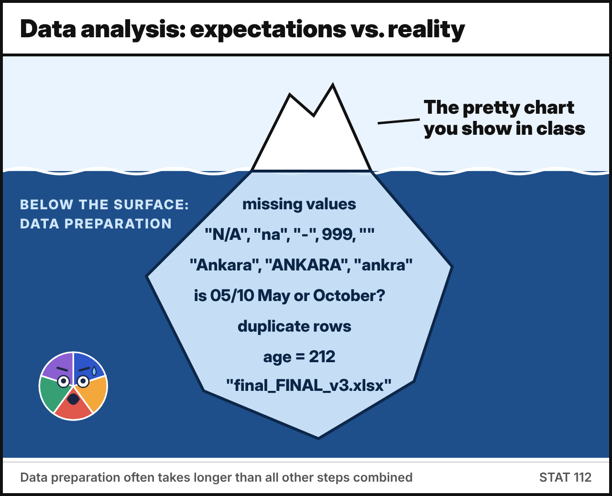{fig-align="center" width="560" fig-alt="Meme: iceberg, the pretty chart above water and data cleaning problems below"}

:::: {.quiz type="order"}
Put the **steps of statistical practice** in the correct order.

- **Model building:** set clear goals and write the research question
- **Data collection:** plan what data to collect and how to collect them
- **Data preparation:** identify dirty data, clean them, handle outliers and missing values
- **Exploratory data analysis (EDA):** get familiar with the data, mostly using visualizations
- **Data analysis:** apply appropriate statistical methods to extract information
- **Data interpretation:** interpret the results and draw conclusions

::: explain
The research question comes first, because it decides which data are worth collecting. Data preparation often takes **more time than all the other steps combined**, which is why a large part of STAT 112 is about cleaning and tidying data.
:::
::::

<!-- ===================================================================== -->

:::: {.quiz type="classify" options="Descriptive|Inferential"}
Is each statement an example of **descriptive** or **inferential** statistics?

- The average GPA of the 40 students in our recitation section is 2.85. :: Descriptive
- Based on a survey of 200 voters, we estimate that the candidate will receive between 45% and 51% of all votes in the city. :: Inferential
- A bar chart shows the number of students enrolled in each department of the faculty. :: Descriptive
- A clinical trial with 300 patients concludes that the new drug lowers blood pressure in adults with hypertension. :: Inferential
- 60% of the people who answered our survey said they use Instagram every day. :: Descriptive

::: explain
**Descriptive** statistics *summarize and present* the data we have, using tables, graphs and numerical measures.
**Inferential** statistics use a sample to draw *conclusions or make decisions about a larger population*. Look for words like *estimate*, *conclude*, or a claim about a group bigger than the one that was measured.
:::
::::

## Part B — Data types and scales of measurement

<!-- ===================================================================== -->

:::: {.quiz type="classify" options="Qualitative|Quantitative"}
The U.S. Army Corps of Engineers studied fish in the Tennessee River (Alabama) and three tributary creeks to measure the effects of DDT pollution. For each of the **144 fish** captured, the following variables were recorded. Classify each variable.

- River/creek where the fish was captured :: Qualitative
- Species (channel catfish, largemouth bass, or smallmouth buffalo fish) :: Qualitative
- Length (centimeters) :: Quantitative
- Weight (grams) :: Quantitative
- DDT concentration (parts per million) :: Quantitative

::: explain
Length, weight and DDT concentration are measured on a **numerical scale** (cm, g, ppm), so they are **quantitative**.
River/creek and species can only be sorted into **categories**, so they are **qualitative** (categorical).
:::
::::

<!-- ===================================================================== -->

:::: {.quiz type="classify" options="Discrete|Continuous"}
Decide whether each variable is **discrete** or **continuous**.

- Number of students present in class today :: Discrete
- A patient's body temperature measured with a thermometer :: Continuous
- Time it takes a student to solve a math problem :: Continuous
- Number of accidents per month (can range from 0 to 50) :: Discrete
- Number of website visitors per second :: Discrete
- Amount of rainfall in a day (mm) :: Continuous
- A runner's speed during a race :: Continuous

::: explain
**Count it → discrete. Measure it → continuous.**
Counts (students, accidents, visitors) can only be whole numbers. Temperature, time, rainfall and speed can take *any* value in an interval; the number of decimals we record is limited only by the measuring instrument.
:::
::::

<!-- ===================================================================== -->

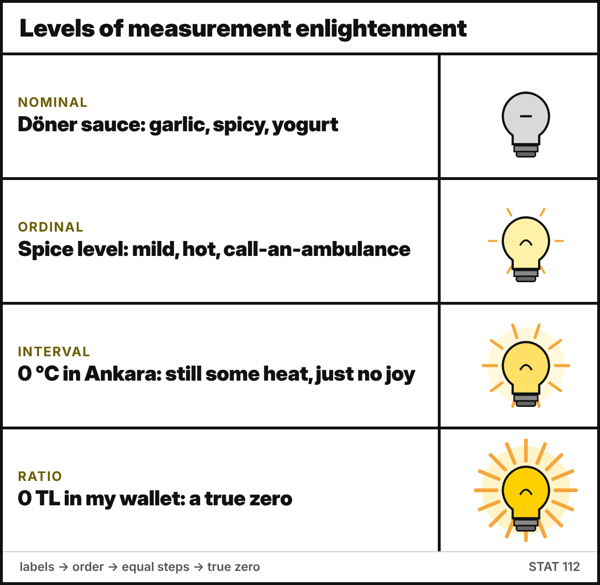{fig-align="center" width="560" fig-alt="Meme: levels of measurement enlightenment from nominal to ratio"}

:::: {.quiz type="match"}
Match each **scale of measurement** with its description.

- Nominal :: Categories with no order or ranking, only labels. You can count frequencies and find the mode.
- Ordinal :: Categories with a meaningful order, but the differences between ranks are not equal or measurable. You can rank and find the median.
- Interval :: Numeric with meaningful, equal differences but **no true zero**. You can add and subtract, but "twice as much" is meaningless.
- Ratio :: Numeric with equal intervals **and a true zero** (zero = none). All of +, −, ×, ÷ are meaningful.

::: explain
Each scale keeps the properties of the previous one and adds one more:
**Nominal** (labels) → **Ordinal** (+ order) → **Interval** (+ equal distances) → **Ratio** (+ a true zero).
:::
::::

<!-- ===================================================================== -->

:::: {.quiz type="classify" options="Nominal|Ordinal|Interval|Ratio ; Qualitative|Quantitative" columns="Scale ; Data type"}
For each scenario, choose the **scale of measurement** and the **type of data**.

- A weather station records daily temperatures in degrees Celsius :: Interval ; Quantitative
- IQ test scores :: Interval ; Quantitative
- A clinic classifies blood pressure as "Normal", "Pre-hypertensive" or "Hypertensive" :: Ordinal ; Qualitative
- A teacher records students' scores out of 100 on a math exam :: Interval | Ratio ; Quantitative
- Respondents identify their gender as "Male", "Female" or "Nonbinary" :: Nominal ; Qualitative
- A car's odometer records the distance traveled (km) during a road trip :: Ratio ; Quantitative
- Moviegoers rate a film from 1 (terrible) to 5 (excellent) :: Ordinal ; Qualitative
- Students' letter grades (AA, BA, BB, …) on their transcripts :: Ordinal ; Qualitative
- Number of votes each candidate received in a local election :: Ratio ; Quantitative
- Individuals' monthly income in Turkish lira :: Ratio ; Quantitative

::: explain
- **Temperature (°C) and IQ are interval:** 0 °C is the freezing point of water, not "no heat", and an IQ of 0 does not mean "no intelligence". So 40 °C is *not* twice as hot as 20 °C.
- **Blood pressure categories are ordinal, not nominal:** Normal < Pre-hypertensive < Hypertensive has a clear order.
- **The film rating (1–5) is ordinal:** the numbers are labels for ordered categories. The step from 1 to 2 is not necessarily the same "amount" as the step from 4 to 5.
- **Exam scores out of 100 are debatable, so both answers are accepted.** The lecture lists SAT-type exam grading as *interval*, because 0 points does not mean "zero knowledge". If you think of the score as "number of points earned", 0 really means none, and the variable is ratio.
- **Distance, vote counts and income** have a true zero, so they are ratio.
:::
::::

<!-- ===================================================================== -->

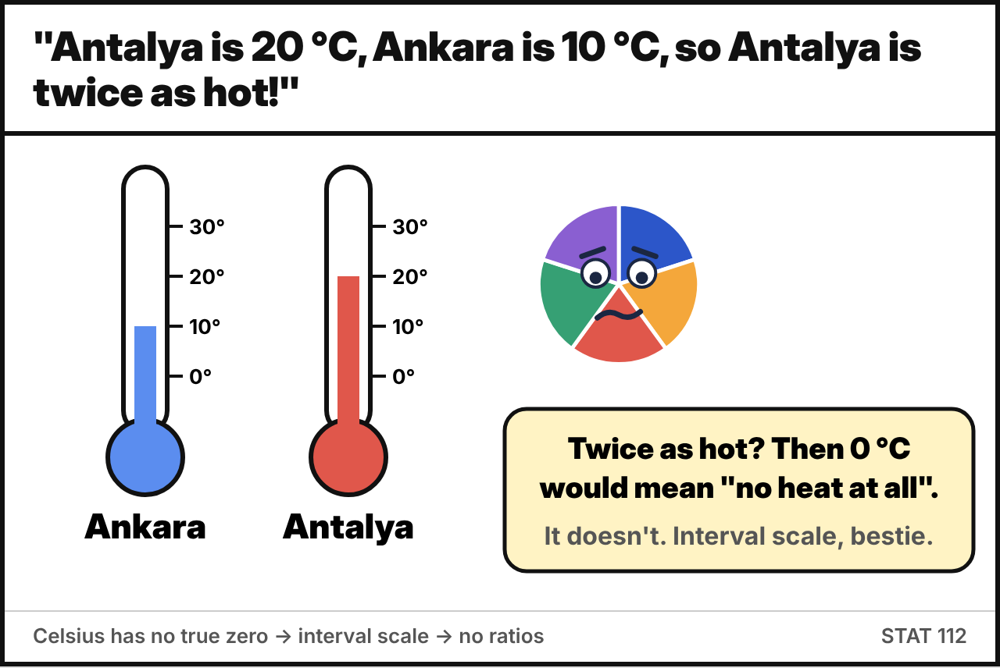{fig-align="center" width="560" fig-alt="Meme: 20 °C is not twice as hot as 10 °C because Celsius is an interval scale"}

:::: {.quiz type="classify" options="Interval|Ratio"}
A dataset contains the following variables. Is each one measured on an **interval** or a **ratio** scale?

- Body height (cm) :: Ratio
- Temperature (°C) :: Interval
- Age (years) :: Ratio
- Calendar year of birth :: Interval
- Time of day on a 24-hour clock :: Interval
- Weight (kg) :: Ratio
- Monthly income (USD) :: Ratio

::: explain
The test: **does 0 mean "none of it"?**

- Year 0 does not mean "the beginning of time", and 00:00 is not "no time", so calendar year and time of day are **interval**. (The year 2000 is not "twice" the year 1000.)
- 0 cm, 0 kg, 0 years and 0 USD all mean "none", so ratios make sense: 40 kg *is* twice as heavy as 20 kg.
:::
::::

<!-- ===================================================================== -->

:::: {.quiz type="classify" options="Nominal|Ordinal|Metric discrete|Metric continuous"}
A dental study records the following variables. Classify each one.

- Number of teeth :: Metric discrete
- Age :: Metric continuous
- Age at last birthday (in years) :: Metric discrete
- Has the patient visited their dentist in the last year? :: Nominal
- Social class :: Ordinal
- Colour of filling material :: Nominal
- Calcium : phosphorus ratio in teeth :: Metric continuous
- Severity of gum disease (none, mild, moderate, severe) :: Ordinal

::: explain
- **Age vs. age at last birthday:** age itself is continuous (time is measured), but "age at last birthday" only takes whole numbers, so it is discrete.
- A **yes/no** variable is nominal (it is also called *binary*).
- Social class and severity have a natural order, so they are ordinal.
:::
::::

<!-- ===================================================================== -->

:::: {.quiz type="mc" answer="b"}
Which summary is meaningful for **ordinal** data but **not** for **nominal** data?

- Mode
- Median
- Mean
- The ratio of two values

::: explain
The **median** needs the values to be *ranked*, which is possible for ordinal data (e.g. *Disagree < Neutral < Agree*) but not for nominal data (e.g. eye colour).
The **mode** works for both. The **mean** and **ratios** need numeric data with equal distances.
:::
::::

<!-- ===================================================================== -->

:::: {.quiz type="short" answer="ratio|ratio scale|ratio scaled"}
Temperature in **Celsius** is an interval variable. On which scale of measurement is temperature in **Kelvin**?

::: explain
**Ratio.** 0 K (absolute zero) means a *complete absence* of thermal energy, so it is a true zero, and 200 K really is twice as much as 100 K.
The quantity is the same (temperature), but the scale depends on **how it is measured**.
:::
::::

<!-- ===================================================================== -->

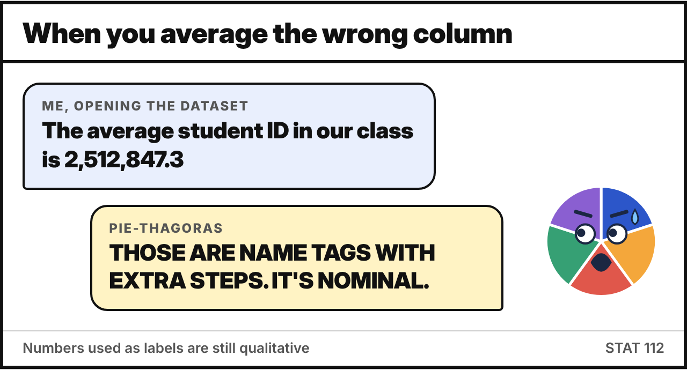{fig-align="center" width="560" fig-alt="Meme: averaging student ID numbers, which are nominal"}

:::: {.quiz type="classify" options="True|False" label="True / False set"}
Decide whether each statement is **true** or **false**.

- If we code gender as 0 = male and 1 = female, gender becomes a quantitative variable. :: False
- Every continuous variable is quantitative. :: True
- On an interval scale, 40 °C is twice as hot as 20 °C. :: False
- Ordinal data tell us the order of the categories but not the size of the differences between them. :: True
- Nominal data must be discrete. :: True
- Student ID numbers are ratio-scaled because they are numbers. :: False

::: explain
- Numbers used as **labels** (0/1 codes, ID numbers, phone numbers, zip codes) have no numerical meaning. They are still **nominal**: averaging student IDs gives nonsense.
- Continuous variables are measured on a numeric scale, so they are always quantitative.
- Nominal categories are separate labels, so you cannot have "half a category". Nominal data are always discrete.
:::
::::

<!-- ===================================================================== -->

:::: {.quiz type="ms" answer="a,c,e"}
Which of the following variables are measured on a **ratio** scale? *Select all that apply.*

- Weight of a newborn baby (kg)
- Temperature in Fahrenheit
- Number of fish in Lake Eymir
- Year of birth
- Time to finish a 100 m race (seconds)
- IQ score

::: explain
Weight, number of fish, and race time all have a **true zero** (0 kg, 0 fish, 0 seconds mean "none"), so they are **ratio**.
Fahrenheit, year of birth and IQ have an *arbitrary* zero, so they are **interval**.
:::
::::

<!-- ===================================================================== -->

:::: {.quiz type="mc" answer="b"}
A quantitative variable **Age** is recoded into groups: 1 = "0–17", 2 = "18–34", 3 = "35–54", 4 = "55+".

What type of variable is the **new, recoded** variable?

- Nominal
- Ordinal
- Interval
- Ratio

::: explain
After recoding, the values 1–4 are **ordered categories**. The groups also have unequal widths (18, 17, 20 years and open-ended), so the distance between codes has no meaning. The new variable is **ordinal**.
Recoding a quantitative variable into categories always **loses information**: we no longer know the exact age.
:::
::::

## Part C — Displaying categorical data

<!-- ===================================================================== -->

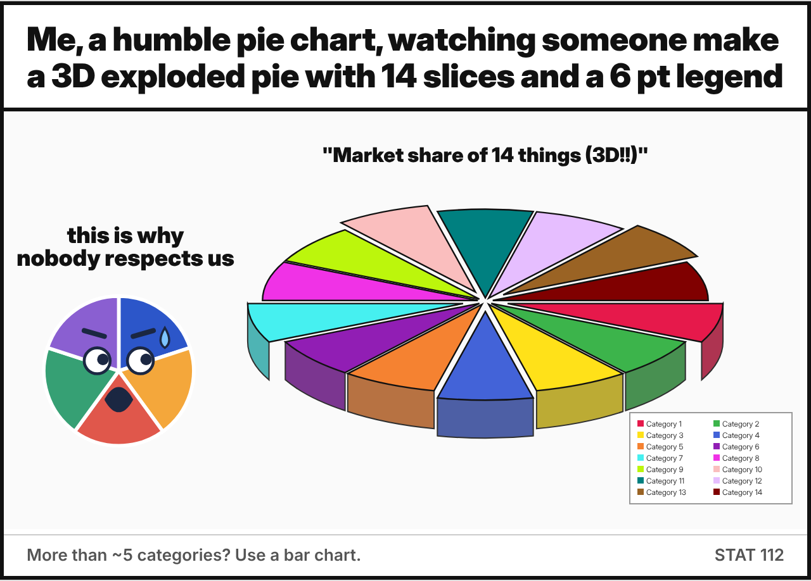{fig-align="center" width="560" fig-alt="Meme: a pie chart horrified by a 3D exploded pie chart with 14 slices"}

:::: {.quiz type="classify" options="Frequency table|Contingency table|Bar chart|Clustered bar chart|Stacked bar chart|Pie chart|Doughnut chart|Waffle chart|Mosaic plot|Spine plot|Population pyramid" label="Name that display"}
Choose the name of each display.

- 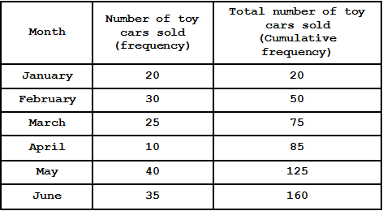 :: Frequency table
- 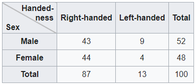 :: Contingency table
- 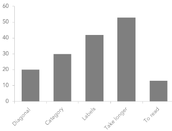 :: Bar chart
- 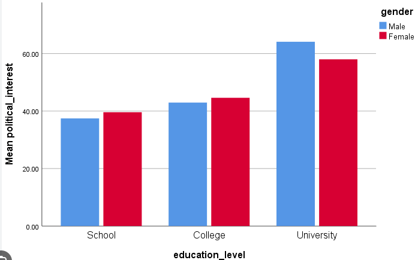 :: Clustered bar chart
- 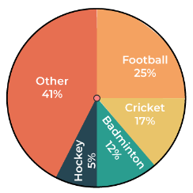 :: Pie chart
- 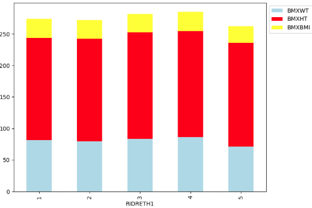 :: Stacked bar chart
- 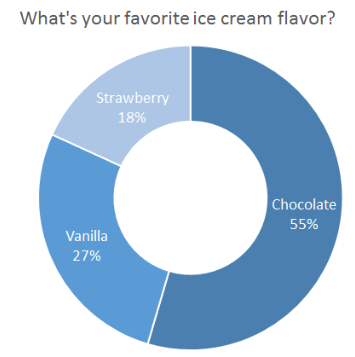 :: Doughnut chart
- 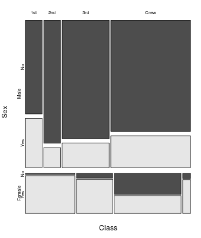 :: Mosaic plot
- 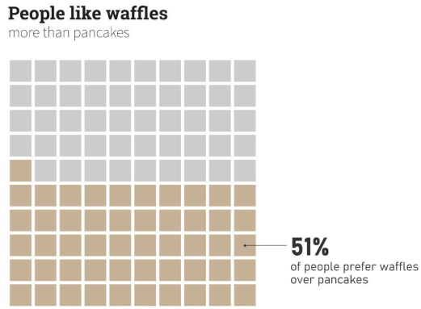 :: Waffle chart
- 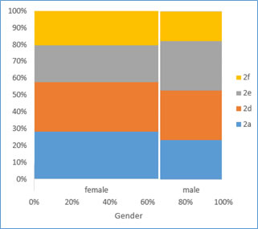 :: Spine plot | Stacked bar chart
- 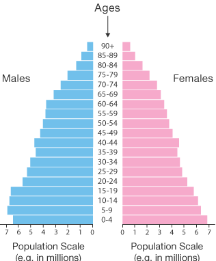 :: Population pyramid

::: explain
- **Clustered** bars put the groups *side by side*. **Stacked** bars put them *on top of each other*.
- A **spine plot** is a 100% stacked bar chart in which the **width** of each bar is proportional to the group size. A **mosaic plot** extends this idea to more than two variables.
- A **waffle chart** shows a percentage as filled squares in a 10 × 10 grid (each square = 1%).
:::
::::

<!-- ===================================================================== -->

:::: {.quiz type="classify" options="One variable|Two or more"}
Is each display used for **one** categorical variable, or to show the relationship between **two or more** categorical variables?

- Frequency table :: One variable
- Pie chart :: One variable
- Contingency (two-way) table :: Two or more
- Waffle chart :: One variable
- Clustered bar chart :: Two or more
- Doughnut chart :: One variable
- Mosaic plot :: Two or more
- Bar chart :: One variable
- Spine plot :: Two or more

::: explain
To compare two categorical variables you need a display that **crosses** them: a contingency table, or clustered, stacked, spine or mosaic plots.
The population pyramid from the previous question also shows **two** variables (age group and sex) as back-to-back bars.
:::
::::

### The student performance dataset

The Center of Assessment and Evaluation wants to study the factors that affect student performance. Information on **110 students** from a high school in Seoul was collected. The first six rows of the data:

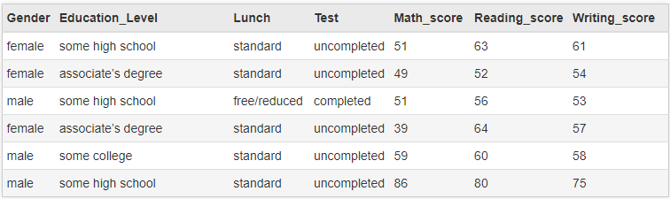{fig-align="center" width="90%"}

*Lunch:* free/reduced or standard lunch. *Test:* "completed" if the student completed a test preparation course, otherwise "uncompleted". *Education_Level* is the parents' education level.

<!-- ===================================================================== -->

:::: {.quiz type="classify" options="Nominal|Ordinal|Quantitative"}
Classify each variable in the dataset.

- Gender :: Nominal
- Education_Level (parents' education) :: Ordinal
- Lunch :: Nominal
- Test (preparation course) :: Nominal
- Math_score :: Quantitative

::: explain
Education level has a natural order: *some high school < high school < some college < associate's < bachelor's < master's*. That makes it **ordinal**, so a bar chart of it should keep that order rather than sorting the bars alphabetically.
Gender, Lunch and Test are labels with no order (*Lunch* and *Test* are binary).
:::
::::

<!-- ===================================================================== -->

:::: {.quiz type="fill"}
Use the frequency table of parents' education level.

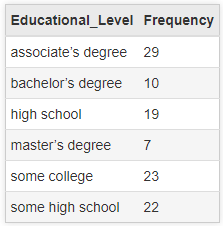{fig-align="center" width="260"}

The total number of students is *n* = []{.blank answer="110" tol="0"}.
The most common (modal) education level is []{.blank answer="associate's degree|associates degree|associate's|associate|associate degree"}.
The relative frequency of "master's degree" is 7/110 = []{.blank answer="0.0636" tol="0.0006"} (4 decimals), which is about []{.blank answer="6.36" tol="0.1"} %.

::: explain
*n* = 29 + 10 + 19 + 7 + 23 + 22 = 110. The largest frequency is 29, for **associate's degree**. The relative frequency of master's degree is 7/110 ≈ 0.0636, or **6.36%**.

Interpretation: *the parents of 29 students (26.4%) have an associate's degree, and the parents of 7 students (6.4%) have a master's degree.*
:::
::::

<!-- ===================================================================== -->

:::: {.quiz type="mc" answer="c"}
Here is the relative frequency table and the bar chart of the same variable.

:::{layout-ncol="2"}
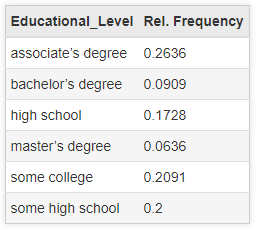

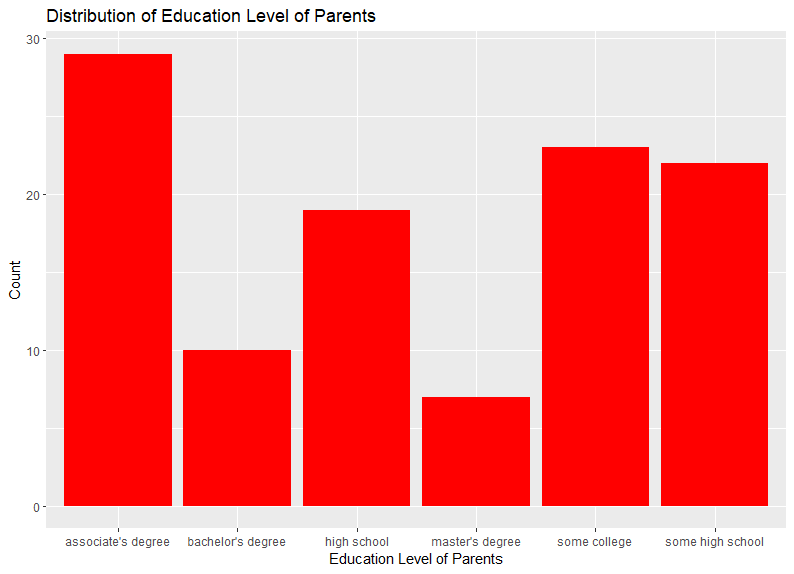
:::

If we re-draw the bar chart using **relative frequencies** instead of counts, how does it change?

- The tallest bar becomes a different category.
- The bars get closer together, because the proportions are all smaller than 1.
- Only the y-axis scale changes. The bars keep exactly the same shape.
- It must be redrawn as a pie chart, because proportions add up to 1.

::: explain
Every relative frequency is the count **divided by the same number** (*n* = 110), so every bar is scaled by the same factor. Only the y-axis labels change, from 0–30 to 0–0.27.
Also notice that this chart orders the bars **alphabetically**. Because education level is ordinal, a better chart would order the bars from *some high school* to *master's degree*.
:::
::::

<!-- ===================================================================== -->

:::: {.quiz type="fill"}
:::{layout-ncol="2"}
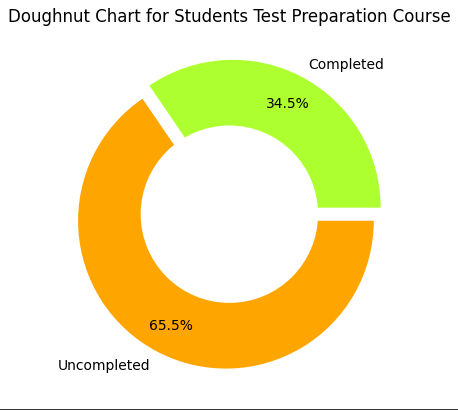

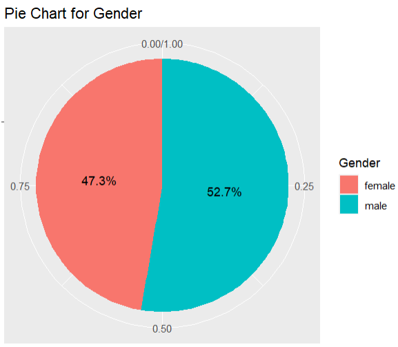
:::

Using the charts and *n* = 110, answer:
about []{.blank answer="38" tol="0.5"} students **completed** the test preparation course, and about []{.blank answer="58" tol="0.5"} students are **male**.

::: explain
- Completed: 0.345 × 110 = 37.95 ≈ **38** students (so 72 did not complete it)
- Male: 0.527 × 110 = 57.97 ≈ **58** students (and 52 female)

Charts that show only percentages hide the sample size, so always report **n** alongside the percentages.
:::
::::

<!-- ===================================================================== -->

:::: {.quiz type="open" keywords="65.5|65 %|66 %; 34.5|34 %|35 %; 52.7|53 %; 47.3|47 %"}
Write a short **interpretation** (2–3 sentences) of the doughnut chart and the pie chart above.

::: explain
The doughnut chart shows that **65.5%** of the students did **not** complete the test preparation course, while **34.5%** completed it. So roughly two out of three students did not take the course.
The pie chart shows that **52.7%** of the students in the study are **male** and **47.3%** are **female**, so the sample is fairly balanced by gender.

*Watch out:* read the labels carefully. The larger (orange) slice is **uncompleted**, not completed.
:::
::::

<!-- ===================================================================== -->

:::: {.quiz type="fill"}
The contingency table shows handedness by sex for 100 people.

{fig-align="center" width="380"}

The total number of left-handed people is []{.blank answer="13" tol="0"}.
The percentage of **males** who are left-handed is []{.blank answer="17.3" tol="0.1"} % (1 decimal).
The percentage of **left-handed people** who are female is []{.blank answer="30.8" tol="0.1"} % (1 decimal).

::: explain
- Left-handed total: 9 + 4 = 13
- Among **males**: 9 / 52 = 0.173 → **17.3%** (we divide by the *row* total, 52)
- Among **left-handers**: 4 / 13 = 0.308 → **30.8%** (we divide by the *column* total, 13)

The two percentages answer **different questions**, so always ask *"percent of what?"* For comparison, only 4/48 = 8.3% of females are left-handed, which suggests that left-handedness is more common among males in this group.
:::
::::

<!-- ===================================================================== -->

:::: {.quiz type="mc" answer="c"}
Using the same table, we want to **compare the proportion of left-handed people among males and among females**. Which display is the best choice?

- A pie chart of handedness
- A clustered bar chart of the **counts**
- A 100% stacked bar chart (or spine plot) of handedness within each sex
- A frequency table of sex

::: explain
To compare *proportions within groups*, every group should be scaled to 100%. That is exactly what a **100% stacked bar chart / spine plot** does, and a spine plot also shows group size through the bar width.
A pie chart and a frequency table each show only **one** variable. A clustered bar chart of counts can mislead when the groups have different sizes.
:::
::::
